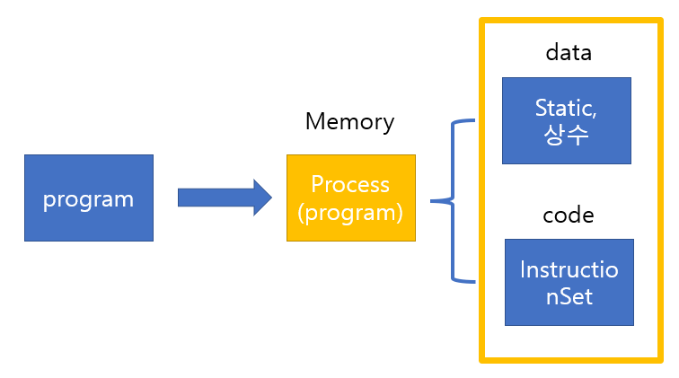
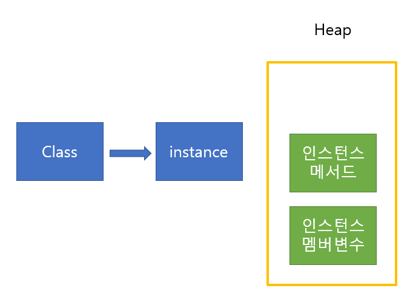
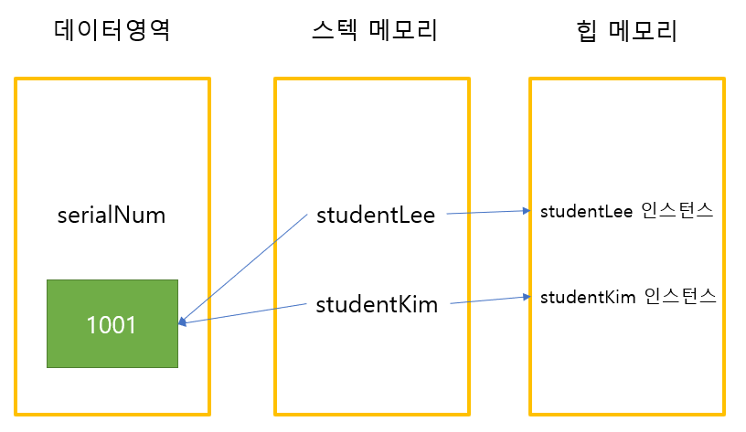

\*\* 공통으로 사용하는 변수가 필요한 경우

여러 인스턴스에서 공통적으로 사용하는 변수가 있을 경우

static을 써야하는 이유

```
public class Person(){
    private name;
    private age;
}
```

> 위와 같은 클래스가 있다고 가정했을때,

> 인스턴스를 생성할 때마다 멤버변수의 경우 heap 메모리에 올라가며

> 인스턴스의 수가 늘어날수록 공통적으로 사용되는 name과 age는 계속 메모리를 잡아먹게된다.

> 따라서, 인스턴스가 생성될때마다 공유할 수 있는 메모리에 올려놓으면 이런 낭비를 막을 수 있다.

> 그런 역할을 할 수 있도록 도와주는 녀석이 static이다.

---

메모리에 관해서 좀 더 자세히 설명해보자면,

program을 구동시키면 메모리에 올라가게된다.

메모리에 올라간 상태를 process상태라고 하고 (process가 직접구동되는 것이 아닌 thread상태로 작업이 진행된다.)

이때, 메모리에 올라가면 프로그램은 두가지 영역을 가지게된다.

data 영역(static,상수 영역이라고도함) , code영역 (instructionset 지시영역)

data 영역은 프로세스 과정처음부터 메모리를 잡는 부분을 말한다.

ex) 상수나 리터럴 static 변수들이 data 영역에 올라간다.

data 영역의 메모리가 사라지는 시기는 프로그램이 종료될때이다.

Heap 메모리는 동적메모리로써 인스턴스가 생성되었을때 생성된
인스턴스가 heap 메모리에 올라가고 다 쓰이고

종료되면 GC(Garbagecollector)가 종료시켜준다.




\*\*\* Static 변수 선언과 사용

인스턴스 생성과 상관없이 사용 가능하므로 클래스 이름으로 직접 참조

```
public class Employee{
    public static int serialNum = 1000;
}
```

호출 = Employee.serialNum

메모리 내용 정리


