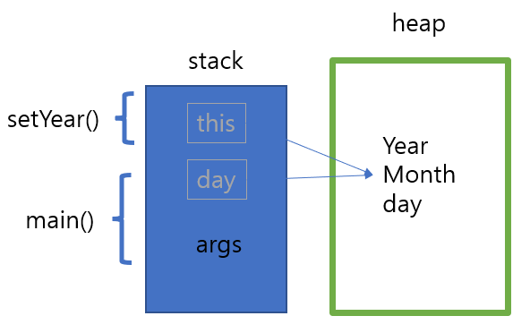

\*\*\* THIS

- 객체 자신을 가리키는 THIS

인스턴스 객체를 생성하게되면 힙 메모리에 생성되는데 힙메모리에 생성되면서 부여된 메모리주소를 갖는 변수를

<참조변수>라고하고, 그 값 자체를 참조값이라고 한다.

참조변수 자체는 인스턴스 자체에 외부에서 가리킨다면, 인스턴스 내부에서 자기자신의 주소값을 가리키는 것이 THIS

---

This를 사용하는 경우

1. 생성자 안에서 또 다른 생성자를 호출하는 경우
2. 인스턴스 자신의 메모리를 가리킴
3. 자신의 주소(참조값)을 반환함

= main메서드가 실행되면서 지역변수들이 stack에 쌓이는 이미지이다.

day와 args는 main함수의 지역변수로 잡히게되고,

setYear메서드가 호출되면서 setYear에 해당되는 메모리가 잡히게되는데

그게 this로 잡히게되고, 갖게되는 값은 heap메모리에 year, month, day이다.

---
